# Projects with R basic & advance for data analysis and visualization

These are exercises to practice and enhance my self-learn R skills to work with data & do some interesting things:
  - Data Preparation
  - Data Mining
  - Data Exploration
  - Data Analysis
  - Data Visualization

# Exercise 1: 
Working with data of more than 600 movies in different genre, ratings, budget & profits to figure out helpful insights


**Step 1: Install all packages for further use**
```sh
install.packages("ggplot2")
install.packages("dplyr")
install.packages('hrbrthemes')
install.packages('viridis')
library(ggplot2)
library(dplyr)
library(hrbrthemes)
library(viridis)
library(reshape2)
```
**Step 2: Insert CSV file & look through data**
```sh
setwd('D:\\Download\\R practice')
movie <- read.csv('Section6-Homework-Data-2.csv')
head(movie)
str(movie)
```
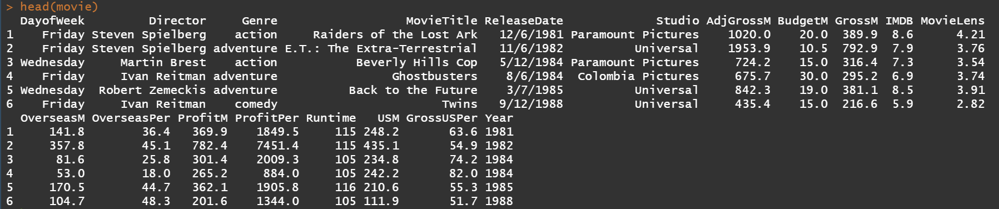
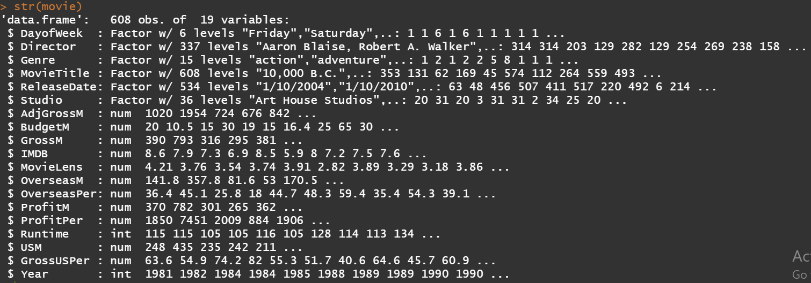

=> Movie data set has a wide range of genre and studios. If we keep it that way, visualization will get some troubles since there are so many variables. 

**Step 3: Classify data to select top 6 Genre/Studios by sales/numbers of movies, asign value "Others" to the rest of Genre/Studios and create new dataframe**
```sh
choosing <- movie %>%
  group_by(Genre) %>%
  summarise(sum_adj = sum(AdjGrossM))
choosing[order(unlist(choosing$sum_adj), decreasing = TRUE),]
```
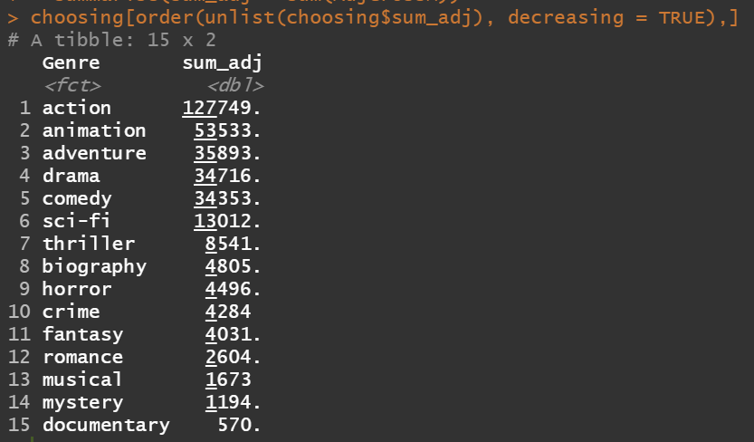

=> base on choosing => list out top 6 genres & asign the rest as "Others"
```sh
`%nin%` = Negate(`%in%`)

movie.data <- subset(movie, movie$Genre %in% c('action', 'adventure', 'animation', 'drama', 'comedy', 'sci-fi'))
movie.data2 <- subset(movie, movie$Genre %nin% c('action', 'adventure',     'animation','drama','comedy', 'sci-fi'))
movie.data2$Genre <- c('Others')
movie2 <- rbind(movie.data, movie.data2)

choosing3 <- movie %>%
  group_by(Studio) %>%
  summarise(sum_adj = sum(GrossM))
choosing3[order(unlist(choosing3$sum_adj), decreasing = TRUE),]

studio.data <- subset(movie, movie$Studio %in% c('Buena Vista Studios','WB','Fox','Universal', 'Paramount Pictures','Sony'))
studio.data2 <- subset(movie, movie$Studio %nin% c('Buena Vista Studios', 'WB','Fox','Universal', 'Paramount Pictures','Sony'))
studio.data2$Studio <- c('Others')
studio2 <- rbind(studio.data, studio.data2)
```
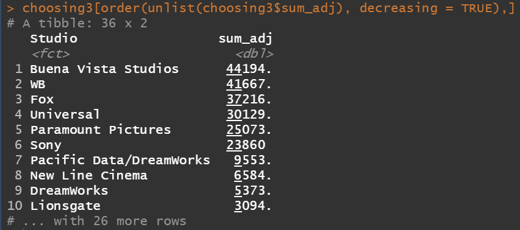

=> base on choosing3 => list out top 6 studios & asign the rest Studios as "Others" 


**Step 4: Start playing with data to see whether there are any interesting facts:**
* In the data set, we have 2 kinds of ratings, 1 from IMDB and 1 from MovieLens (both are reputative rating websites)
```sh
o <- ggplot(data=movie.data, aes(x=IMDB, y=MovieLens, color=Genre))
o + geom_point() + geom_smooth(fill=NA)
```
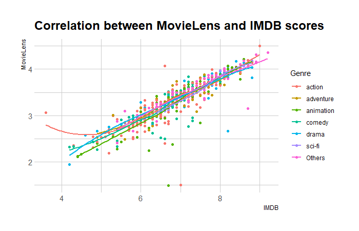

=> From the the scatterplot, we can see that 2 websites have a positive correlation. Therefore, in my preference, I will use IMDB score as the standard movie rating in this exercise 

* **_Correlation between Budget and Revenue divided by Genre_**
```sh
o + geom_point(aes(x=BudgetM, y=GrossM)) + geom_smooth(aes(x=BudgetM, y=GrossM), fill=NA) +
  facet_grid(.~Genre) +
  xlab('Budget Millions')  +
  ylab('Gross Millions')
```
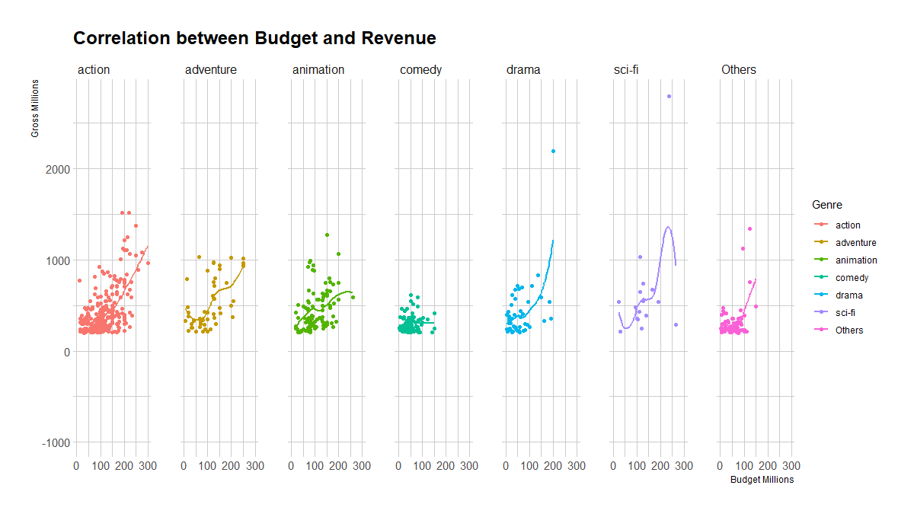

=> Positive correlation between Budget and Sales, the more you give, the more you get. However, be noted that this is not a constant situation and can not apply to Comedy.


* **_Growth of movie industry by Genre_**
```sh
s <- ggplot(data=movie2, aes(x=Year))

s + geom_histogram(aes(fill=Genre), color='White') +
  ylab('# movies') +
  labs(title='Growth of Movie industry by Genre') +
  theme_ipsum()
```
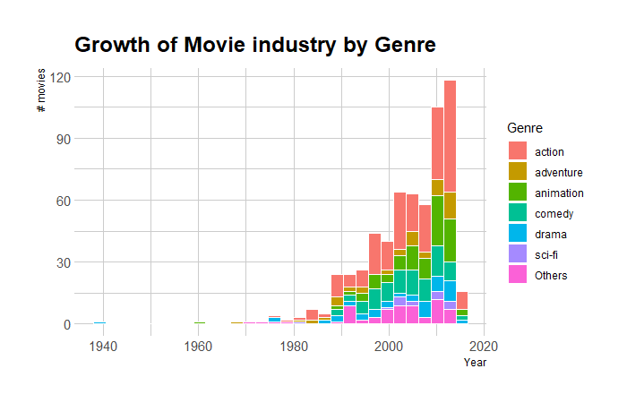

=> Movie industry starts exploding since the 1980s, with fast-speed increase in no. of movies, leading by Action, Animation & Comedy

* **_Average Budget & Profit by Genre, remove outlier_**
```sh
movie3 <- subset(movie2, select = c('Genre','BudgetM','ProfitM'))
movie32 <- melt(movie3, id.vars='Genre')
n <- ggplot(data=movie32, aes(x=Genre, y=value, fill=variable))

n + geom_boxplot(outlier.shape = NA) + coord_cartesian(ylim=c(0,1000)) +
  ggtitle('Avg Budget & Profit by Genre') +
  ylab('mUSD') +
  theme_ipsum()
```
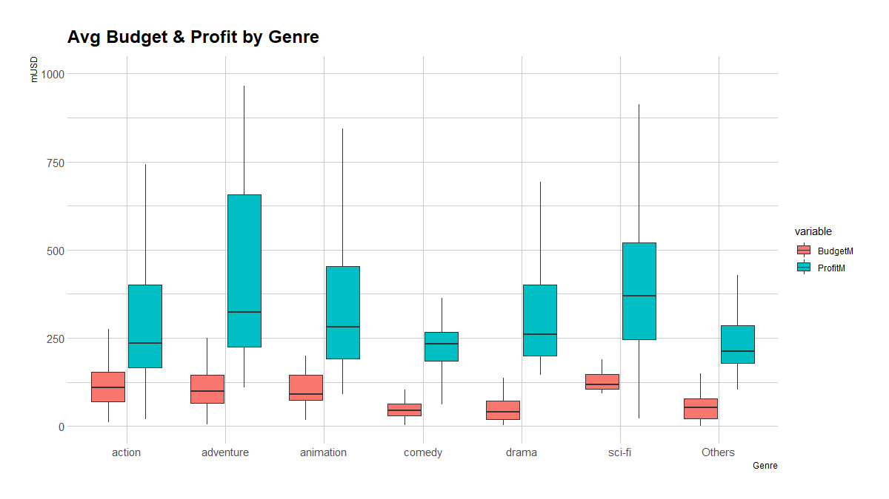

=> Even though Action has really high Budget, it's still in the top lowest Profit, which leads to the lowest %Profit/Revenue. 
Sci-fi situation is quite better, when returning the most average Profit. 
Drama & Comedy, on the other hand, have both low Budget and Profit in terms of value, but have highest %Profit/Revenue. 


* **_Revenue & Profit of each Studio during the whole period_**
```sh
bar_lab <- studio.data %>%
  group_by(Studio) %>%
  summarise(Gross=sum(GrossM), Profit=sum(ProfitM))

bar_lab
bar_lab <- as.data.frame(bar_lab)

library(reshape2)
bar_lab2 <- melt(bar_lab2, id.vars = 'Studio')

ggplot() +  
  geom_bar(data= subset(bar_lab2, variable %in% c('Gross','Profit')), aes(x=Studio, y=value, fill=variable), stat='identity',width=0.5, position = 'dodge') +
  labs(title = 'Revenue & Profit of each Studio during 1967-2015', color='', fill='') +
  geom_text(data= subset(bar_lab2, variable %in% c('Gross','Profit')),aes(x=Studio, y=value, color=variable, label=(round(value))), vjust = -0.3, 
            position = position_dodge(width = 0.5)) +
  geom_point(data= subset(bar_lab2, variable %in% c('ProfitPer')), aes(x=Studio, y=value*50000/100, fill=variable, color=variable), group=1, size=3) +
  scale_y_continuous(
    name=expression('mUSD'),
    sec.axis = sec_axis(~.*100/50000, name='%Profit') ) +
  geom_text(data= subset(bar_lab2, variable %in% c('ProfitPer')), aes(x=Studio, y=value*50000/100, color=variable, label=round(value,0)), size=4, vjust=-0.7) +
  theme_ipsum()
```

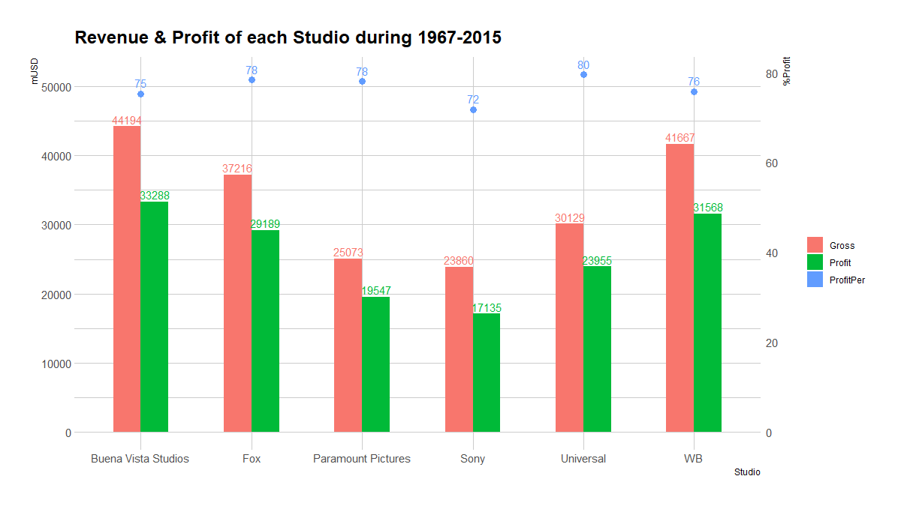

=> Buena Vista is the highest revenue & profit studio throughout the period. And guess what? It's Walt Disney! Following by WB (Warner Bros) & Fox. 
However, when looking at Profit/Revenue,  Universal seems to be the leader with 80% return.


# Exercise 2:

Working with dataset of 500 companies in various indutries across USA to measure how they've performed.

**_Step 1: Insert the dataset & look through data_** 
```sh
fin <- read.csv('P3-Future-500-The-Dataset.csv', na.strings = c(''))
```
=> We replace blank space with N/A in order to easier detect missing values
```sh
summary(fin)
str(fin)
```
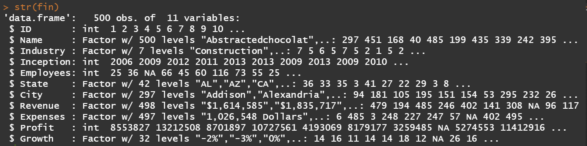
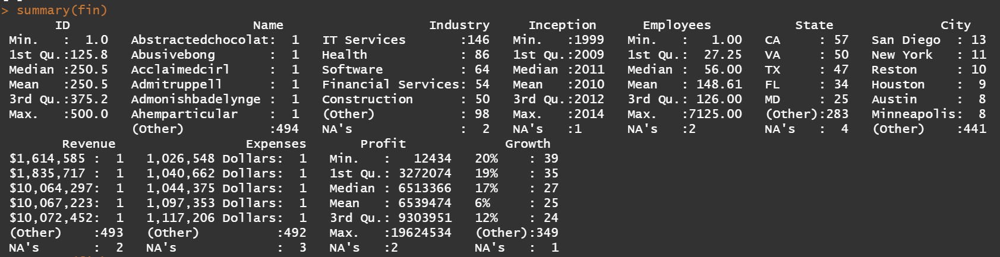

=> Dataset has structure like in the picture above, with 3 columns Revenue/ Expenses/ Growth should have been classified as "Number" instead of "Factor", vice versa for column "ID"

**_Step 2: Converting to proper formats for further analysis_** 

```sh
fin$ID <- factor(fin$ID)

fin$Expenses <- gsub(' Dollars','', fin$Expenses)
fin$Expenses <- gsub(',','', fin$Expenses)
fin$Revenue <- sub('\\$','', fin$Revenue)
fin$Revenue <- gsub(',','', fin$Revenue)
fin$Growth <- gsub('%','', fin$Growth)

fin$Expenses <- as.numeric(fin$Expenses)
fin$Revenue <- as.numeric(fin$Revenue)
fin$Growth <- as.numeric(fin$Growth)
```
=> After adjusting, ID type is now factor. Expenses/Profit/Growth are now numeric values. 

**_Step 3: Replacing missing data with proper methods so that it will not affect our analysis results_**
- Locating missing data:
```sh
nrow(fin[!complete.cases(fin),])
fin[!complete.cases(fin),]
```
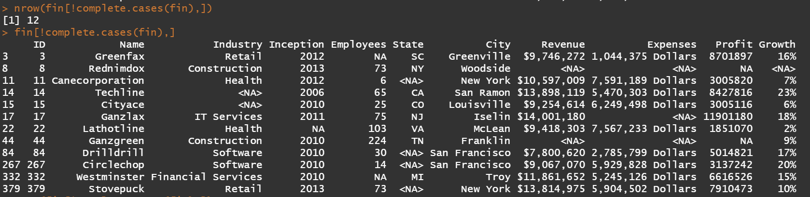

=> The dataset has total 12 rows with missing data.
2 in column Industry, 1 in Inception, 2 in Employees, 4 in States, 2 in each Revenue/Expense/Profit and 1 in Growth


- For column Industry & Inception, search online to see whether we have any information about the company, remove rows if couldn't find out the result and reset data frame index
```sh
fin_backup <- fin #Backup data before editing anything

#For Techline, result is IT Services => replace N/A with correct data
fin[fin$Name == 'Techline',3] <- c('IT Services')
#For Cityace & Lathotline, no result found => remove it from the dataset
fin <- fin[!is.na(fin$Industry),]
fin <- fin[!is.na(fin$Inception),]

#Reset row index
rownames(fin) <- NULL
```

- For column State, use factual data and asign for the missing ones
```sh
fin[is.na(fin$State) & fin$City=='New York','State'] <- 'NY'
fin[is.na(fin$State) & fin$City=='San Francisco','State'] <- 'CA'
```

- For column Revenue/Expenses/Employees/Growth, use median imputation method by calculating the average of according industry
```sh
med_emp_retail <- median(fin[fin$Industry=='Retail','Employees'], na.rm = TRUE)
fin[is.na(fin$Employees) & fin$Industry=='Retail','Employees'] <- med_emp_retail

med_emp_finser <- median(fin[fin$Industry=='Financial Services','Employees'], na.rm = TRUE)
fin[is.na(fin$Employees) & fin$Industry=='Financial Services','Employees'] <- med_emp_finser

med_growth_cons <- median(fin[fin$Industry=='Construction','Growth'], na.rm = TRUE)
fin[is.na(fin$Growth) & fin$Industry=='Construction', 'Growth'] <- med_growth_cons

med_rev_cons <- median(fin[fin$Industry=='Construction','Revenue'], na.rm = TRUE)
fin[is.na(fin$Revenue) & fin$Industry=='Construction', 'Revenue'] <- med_rev_cons

med_exp_cons <- median(fin[fin$Industry=='Construction','Expenses'], na.rm = TRUE)
fin[is.na(fin$Expenses) & fin$Industry=='Construction', 'Expenses'] <- med_exp_cons
```
- Finally, when missing only 1 component among 3 (Revenue/Expenses/Profit), we can derive the value by adding/subtracting 2 others:
```sh
fin[is.na(fin$Profit),'Profit'] <- fin[is.na(fin$Profit),'Revenue'] - fin[is.na(fin$Profit),'Expenses']

fin[is.na(fin$Expenses),'Expenses'] <- fin[is.na(fin$Expenses),'Revenue'] - fin[is.na(fin$Expenses),'Profit']
```

Check again to see whether there is any other missing record
```sh
fin[is.na(fin),]
```


**_Step 4: Visualizing the result_**

- Revenue/ Expenses/ Profit trend by Industry

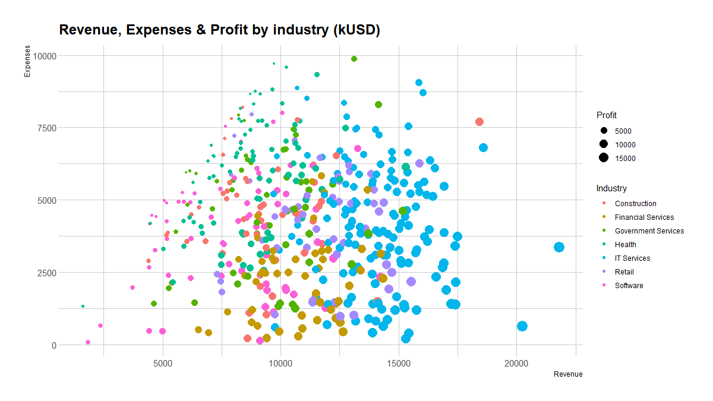

=> IT Services is the champion with highest Profit - it's also the segment generating highest average Revenue among all industries - while Financial Services and Retail are following up in the second tier. Other industries have a wide range of Revenue/Expenses leading to diversified Profit results.

- Growth Rate by Industry

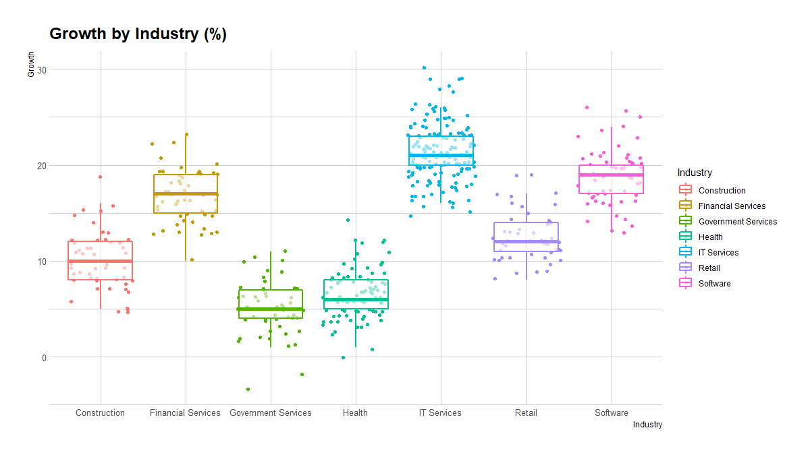

=> Growth Rate are quite understandable with new & modern services (in cluding IT, Finance & Software) having high rate,  while other old & traditional ones (Construction, Health, Gov Services...) are lower.


